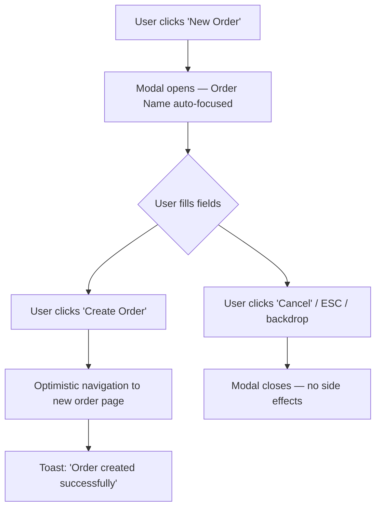

# Order Creation Flow — Design Report

> **Author:** Senior Product Design Review  
> **Date:** 25 February 2026  
> **Stack:** React 19 · HeroUI v3 Beta 7 · Tailwind CSS v4 · TanStack Router  
> **Quality Benchmark:** Linear · Vercel · Stripe

---

## 1. Executive Summary

The order page is mature — all tabs (Overview, Upload, Photos, Messages, Timeline, Billing, Matching, Team, Moderation, Shot List) are implemented with a consistent premium aesthetic. The next logical step is enabling users to **create new orders** from within the project context.

This report defines the recommended design for the creation flow: a focused, low-friction modal form that matches the existing dark-themed UI language and leverages HeroUI v3 compound components natively.

---

## 2. UX Pattern — Modal vs. Drawer vs. Full Page

### Recommendation: **Centred Modal** (`Modal.Container size="md"`)

| Pattern | Verdict | Reasoning |
|:--------|:--------|:----------|
| **Modal** | ✅ **Chosen** | 5 optional fields = lightweight form. Modals signal focused, interruptive creation — exactly right for "new order". Matches existing `TeamMemberModal` precedent. Linear and Vercel both use modals for entity creation. |
| Drawer (side panel) | ❌ Rejected | Better for multi-section editing or preview-beside-form layouts. Overkill for 5 fields. HeroUI v3 has no native Drawer — would require custom build. |
| Full page | ❌ Rejected | Removes user from current context. Only justified for complex multi-step wizards. |
| Inline / expandable | ❌ Rejected | No natural anchor point in the current order-list view. Breaks visual hierarchy. |

### Modal Configuration

| Property | Value | Rationale |
|:---------|:------|:----------|
| `size` | `"md"` | ~480 px max-width — sufficient for single-column form without feeling cramped |
| `placement` | `"auto"` | Vertically centres on desktop; lifts above keyboard on mobile |
| `scroll` | `"inside"` | Keeps footer actions pinned — prevents form from pushing buttons off-screen |
| Backdrop | `variant="blur"` | Premium glassmorphism. Matches project's `shadow-premium-*` / `--color-glass` tokens |
| Dismiss | `isDismissable={true}` | Click-outside to cancel — standard for optional-field forms. No unsaved-data risk |

---

## 3. Form Layout & Visual Structure

### 3.1 Anatomy (top → bottom)

```
┌─────────────────────────────────────┐
│  ✕ Close                            │  ← Modal.CloseTrigger
│                                     │
│  📋  New Order                      │  ← Modal.Header + Modal.Icon
│  Create a photography order for     │
│  this project.                      │  ← subtitle (text-muted)
│                                     │
├─────────────────────────────────────┤
│                                     │
│  Order Name          ____________   │  ← TextField + Input
│                                     │
│  ─── Contacts ─────────────────── │  ← visual divider / group label
│                                     │
│  Contact 1           ____________   │  ← TextField + Input
│  Contact 2           ____________   │  ← TextField + Input
│                                     │
│  ─── Session Details ──────────── │  ← visual divider / group label
│                                     │
│  Shooting Address    ____________   │  ← TextField + TextArea (2 rows)
│  Session Date        📅 ________   │  ← DatePicker
│                                     │
├─────────────────────────────────────┤
│              Cancel    Create Order │  ← Modal.Footer
└─────────────────────────────────────┘
```

### 3.2 Field Grouping

Fields are organised into **three semantic groups** using lightweight `<Separator />` or a subtle label — not heavy section cards. This mirrors Linear's creation dialog approach: minimal chrome, maximal clarity.

| Group | Fields | Rationale |
|:------|:-------|:----------|
| **Identity** | Order Name | Primary identifier — top of form, auto-focused |
| **Contacts** | Contact 1, Contact 2 | Logically paired — client-facing people |
| **Session Details** | Shooting Address, Session Date | Logistics — when/where the shoot happens |

### 3.3 Visual Styling

| Element | Implementation | Token / Class |
|:--------|:---------------|:--------------|
| Modal dialog | `Modal.Dialog` | Default HeroUI surface — adapts to light/dark |
| Icon | `Modal.Icon` with `lucide:clipboard-plus` | `bg-accent-soft text-accent-soft-foreground` |
| Group labels | `<span>` | `text-xs font-semibold uppercase tracking-wider text-muted` ← matches `TEXT_SECTION_LABEL` token |
| Text fields | `TextField` + `Label` + `Input` | Full-width, standard HeroUI styling |
| Address field | `TextField` + `Label` + `TextArea rows={2}` | Multi-line for full addresses |
| Date field | `DatePicker` + `DateField.Group` + `Calendar` | HeroUI v3 date picker with popover calendar |
| Footer bg | `Modal.Footer` | Subtle `border-t border-default-100` for separation |

---

## 4. Interaction Design

### 4.1 Trigger

| Location | Element | Behaviour |
|:---------|:--------|:----------|
| **Orders list page** (primary) | `<Button variant="primary">` with `lucide:plus` icon | Top-right of order list. Label: **"New Order"**. Opens modal via `useOverlayState()` |
| **Overview Quick Actions** | Text link in Quick Actions panel | Secondary entry point. Label: **"Create Order"** with `lucide:plus` icon |
| **Keyboard shortcut** (future) | `Cmd+N` / `Ctrl+N` | Stretch goal — matches Linear's shortcut UX |

### 4.2 Flow



### 4.3 Confirmation

| Action | Behaviour |
|:-------|:----------|
| **Create Order** (primary CTA) | Closes modal → navigates to the new order's Overview tab via TanStack Router `navigate()` → shows success `Toast` |
| **Cancel** button | `slot="close"` — closes modal, no action |
| **ESC key** | Same as Cancel |
| **Backdrop click** | Same as Cancel |
| **✕ button** | `Modal.CloseTrigger` — same as Cancel |

### 4.4 Submit Button States

| State | Visual | Condition |
|:------|:-------|:----------|
| Default | `variant="primary"`, full label | Always active — all fields optional |
| Submitting | `isLoading={true}`, spinner replaces icon | During API call |
| Disabled | N/A | Never disabled — all fields optional, user can create empty order |

> [!IMPORTANT]
> Since every field is optional, the **Create Order** button should **always be enabled**. This is a deliberate UX choice — photography studios may create skeleton orders to fill in later. The button always being actionable reduces friction.

---

## 5. Validation Approach

### Strategy: **Lenient — No Blocking Validation**

Since all fields are optional, there are no required-field checks. However, **soft validation** improves data quality:

| Field | Validation Type | Behaviour |
|:------|:----------------|:----------|
| Order Name | Soft hint | `Description` below field: *"e.g. Budget King Berlin — Spring Collection"* |
| Contact 1 / 2 | None | Free text — names, emails, or phone numbers |
| Shooting Address | None | Free text, multi-line |
| Session Date | `minValue` | Warn (not block) if date is in the past via `FieldError`: *"This date is in the past"* |

### Why Lenient?

- **Photography workflow context**: Studios often create orders retroactively for completed shoots
- **All-optional spec**: Blocking validation contradicts the optional requirement
- **Linear precedent**: Issue creation has zero required fields beyond title
- **Stripe precedent**: Product creation allows minimal initial data

---

## 6. Additional Fields Worth Considering

Beyond the five specified fields, these metadata fields would add significant value for a photography order management context:

### High Priority (Recommend for V1)

| Field | Type | Rationale |
|:------|:-----|:----------|
| **Order Type** | `Select` dropdown | Product shoot vs. lifestyle vs. event — drives workflow templates. Values: `Product`, `Lifestyle`, `Portrait`, `Event`, `Other` |
| **Internal Notes** | `TextArea` | Private team notes not visible to client. Positioned below all other fields with distinct styling (`text-muted` label) |

### Medium Priority (Recommend for V2)

| Field | Type | Rationale |
|:------|:-----|:----------|
| **Expected Photo Count** | `NumberField` | Helps estimate workload and pricing. Drives shot list pre-population |
| **Priority** | `Select` or `RadioGroup` | `Normal`, `Rush`, `Critical` — affects timeline and pricing |
| **Client Reference / PO Number** | `TextField` | External reference for billing reconciliation (common in B2B photography) |
| **Session Time** | `TimeField` | Complement to Session Date — exact shoot start time |

### Lower Priority (Future)

| Field | Type | Rationale |
|:------|:-----|:----------|
| **Assigned Photographer** | `ComboBox` (like TeamMemberModal) | Pre-assign before order creation |
| **Template** | `Select` | Clone from existing order template with pre-filled workflow |
| **Tags / Labels** | `TagGroup` | For filtering and organisation across projects |
| **Budget / Rate Card** | `Select` | Link to existing rate card at creation time (currently managed in Rate Management) |

---

## 7. Empty & Edge States

| State | Design |
|:------|:-------|
| **All fields empty** | Valid — user can submit immediately. The Overview tab would show "—" or "Not set" for empty fields |
| **Very long order name** | `Input` has no `maxLength` but truncates in breadcrumbs/header via CSS `truncate` |
| **Past session date** | Show inline `FieldError` warning: *"This date is in the past"* — allow submission |
| **Duplicate order name** | No client-side check. Server returns error → `Toast` with `color="danger"` |
| **Network failure** | Button returns to default state. `Toast` with retry: *"Could not create order. Please try again."* |

---

## 8. HeroUI v3 Component Mapping

Every element maps directly to an existing HeroUI v3 component — **no custom components required**.

| UI Element | HeroUI Component | Import |
|:-----------|:-----------------|:-------|
| Modal shell | `Modal`, `Modal.Backdrop`, `Modal.Container`, `Modal.Dialog` | `@heroui/react` |
| Close button | `Modal.CloseTrigger` | `@heroui/react` |
| Header icon | `Modal.Icon` | `@heroui/react` |
| Title | `Modal.Heading` | `@heroui/react` |
| Text fields | `TextField`, `Label`, `Input` | `@heroui/react` |
| Address field | `TextField`, `Label`, `TextArea` | `@heroui/react` |
| Date picker | `DatePicker`, `DateField`, `Calendar`, `Label` | `@heroui/react` |
| Footer buttons | `Button` with `slot="close"` and `variant="secondary"` / `variant="primary"` | `@heroui/react` |
| Success toast | `Toast` | `@heroui/react` |
| Trigger button | `Button` with `lucide:plus` icon | `@heroui/react` |
| Group dividers | `Separator` or styled `<span>` | `@heroui/react` or native |
| State management | `useOverlayState()` | `@heroui/react` |

---

## 9. Code Architecture Plan

Following project conventions from `dev_instruction_v3.1.md`:

| Concern | File | Pattern |
|:--------|:-----|:--------|
| **Modal component** | `src/components/CreateOrderModal.tsx` | Named export `CreateOrderModal`. Props: `isOpen`, `onOpenChange`, `projectId` |
| **Form state hook** | `src/hooks/useCreateOrder.ts` | Named export `useCreateOrder()`. Returns form state + `handleSubmit`. Uses `useMutation` from TanStack Query |
| **Mock mutation** | `src/data/mock-create-order.ts` | Simulated API delay (800 ms) + generates order ID |
| **Type definition** | `src/types/order.ts` | `CreateOrderPayload` interface |
| **Route integration** | `src/router.tsx` | Post-creation `navigate()` to new order's `/overview` |

### Structural Reference

The `TeamMemberModal.tsx` (147 lines) is the closest existing pattern and should serve as the architectural template:

- Controlled `isOpen` / `onOpenChange` props
- HeroUI compound Modal structure
- `ComboBox` for search — same interaction density as this form
- Footer with Cancel + primary action

---

## 10. Premium Quality Checklist

Measured against Linear, Vercel, and Stripe standards:

| Criterion | Spec |
|:----------|:-----|
| **Speed to complete** | < 5 seconds for empty order, < 15 seconds with all fields |
| **Auto-focus** | Order Name field focused on open |
| **Keyboard flow** | Tab through all fields → Enter to submit |
| **Animation** | Kinematic scale entrance (existing HeroUI default) |
| **Dark mode** | Full dark theme support via HeroUI semantic tokens |
| **Mobile** | Modal lifts above keyboard (`placement="auto"`); touch-friendly input targets |
| **Loading state** | Spinner on submit button during mutation |
| **Success feedback** | Toast notification + immediate navigation |
| **Error recovery** | Toast with error message; form state preserved |
| **Accessibility** | Focus trap, ESC to close, ARIA labels on all fields, screen reader announcements |
| **Typography** | `Libre Franklin` (project default), semantic sizing via tokens |
| **Visual density** | Comfortable padding (`p-6` body); `gap-4` between fields — not cramped |

---

## 11. Design Decisions Summary

| Decision | Choice | Alternative Considered |
|:---------|:-------|:-----------------------|
| Container type | Modal | Drawer, full page |
| Modal size | `md` (~480 px) | `lg` — too wide for 5 fields |
| Backdrop | Blur | Opaque — too heavy; transparent — no focus |
| Field layout | Single column | Two-column — unnecessary for 5 fields |
| Submit always enabled | Yes | Disable until ≥1 field filled — contradicts "all optional" |
| Date validation | Warn-only for past dates | Block past dates — too restrictive for retroactive orders |
| State management | `useOverlayState()` | `useState` — less ergonomic, `useOverlayState` is the HeroUI-idiomatic way |
| Post-creation flow | Navigate to new order | Stay on list — less engaging; user expects to land on new entity |

---

## 12. Next Steps

1. **Review and approve** this design report
2. **Implement** `CreateOrderModal.tsx` following the architecture plan (§9)
3. **Integrate** trigger button into the orders list / project page
4. **Verify** dark mode, keyboard nav, and mobile responsiveness
5. **Iterate** on additional fields (§6) based on user feedback
