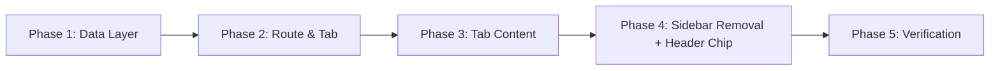

# Order Details Tab — Implementation Plan

## Goal

Add a new "Order Details" tab immediately after "Overview" in the order tab strip. It displays all fields from the `CreateOrderModal` plus additional metadata recommended in the prior analysis. Simultaneously: remove the `OrderInfo` sidebar, replace the "photos" chip in `OrderPageHeader` with a project-name chip.

---

## Phase 1 — Data Layer

All downstream UI depends on these types and mock data being available first.

> [!IMPORTANT]
> No visual changes are visible in the browser after Phase 1.

---

### 1.1 Extend `OrderData` type

#### [MODIFY] [mock-order.ts](file:///Users/eugene/Library/CloudStorage/GoogleDrive-info@semeykin.com/My%20Drive/Antigravity/ERP/src/data/mock-order.ts)

Add the following fields to the `OrderData` interface:

| Field | Type | Source |
|---|---|---|
| `orderName` | `string` | `CreateOrderPayload.orderName` |
| `contact` | `ContactPayload` | `CreateOrderPayload.contact` |
| `secondaryContact` | `ContactPayload \| null` | New (analysis recommendation) |
| `address` | Align with `AddressPayload` from `order.ts` (add `line2`, `postcode`) | `CreateOrderPayload.address` — currently `StructuredAddress` has `state` but not `line2`/`postcode`; unify shapes |
| `sessionTime` | `CalendarDateTime \| null` | Already partially exists as `orderDate` — rename for clarity |
| `createdAt` | `string` (ISO) | Analysis recommendation: audit timestamp |
| `modifiedAt` | `string \| null` (ISO) | Analysis recommendation: audit timestamp |
| `assignedLead` | `{ name: string; role: string } \| null` | Analysis recommendation: team lead |

Populate `mockOrderData` with realistic values for all new fields.

**Acceptance criteria:**

- [x] `OrderData` contains all fields listed above
- [x] `mockOrderData` has non-empty values for the required fields
- [x] `StructuredAddress` is unified with `AddressPayload` (single canonical shape) or `AddressPayload` is reused
- [x] `npm run build` passes

---

### 1.2 Create billing context derivation hook

#### [NEW] [useOrderDetails.ts](file:///Users/eugene/Library/CloudStorage/GoogleDrive-info@semeykin.com/My%20Drive/Antigravity/ERP/src/hooks/useOrderDetails.ts)

Hook that composes `useOrder()` and `useOrderBillingLines(orderId)` to derive:

- **Order type** — set of distinct service categories inferred from `rateItemId` on active (non-voided) billing lines. Return as `string[]` (e.g., `["Photography", "Editing"]`).
- **Total session hours** — sum of `quantityEffective` across all active billing lines where the corresponding rate item has `unitType === 'hour'`. Return as `number`.
- **Scope summary** — array of `{ name: string; quantity: number; unit: UnitType }` for each distinct rate item.

The hook aggregates data from existing hooks — no new API calls needed. Uses the `useQuery` pattern per [dev_instruction_v3.1.md](file:///Users/eugene/Library/CloudStorage/GoogleDrive-info@semeykin.com/My%20Drive/Antigravity/ERP/docs/dev_instruction_v3.1.md) §Data Management. Return a flat object per §Logic Extraction.

**Acceptance criteria:**

- [x] Named export: `export function useOrderDetails(orderId: string)`
- [x] Returns `{ order, orderTypes, totalSessionHours, scopeLines, isLoading }`
- [x] No `any` types
- [x] `npm run build` passes

---

## Phase 2 — Route & Tab Registration

> [!IMPORTANT]
> After Phase 2 task 2.2, the new tab is visible in the browser and navigable — it renders an empty placeholder.

---

### 2.1 Create `OrderDetailsTab` component (stub)

#### [NEW] [OrderDetailsTab.tsx](file:///Users/eugene/Library/CloudStorage/GoogleDrive-info@semeykin.com/My%20Drive/Antigravity/ERP/src/components/OrderDetails/OrderDetailsTab.tsx)

Directory: `src/components/OrderDetails/` (new directory, matches `Overview/`, `OrderBilling/` pattern).

Stub content: a header matching the `OverviewTab` pattern:

```tsx
<header className="mb-1">
    <h2 className="text-2xl font-black text-default-900 tracking-tight">
        Order Details
    </h2>
    <p className="text-sm font-medium text-default-500 mt-1">
        Contact, location, schedule, and billing context for this order.
    </p>
</header>
```

**References:**

- Header pattern: [OverviewTab.tsx](file:///Users/eugene/Library/CloudStorage/GoogleDrive-info@semeykin.com/My%20Drive/Antigravity/ERP/src/components/Overview/OverviewTab.tsx) lines 32–38
- Named exports: [dev_instruction_v3.1.md](file:///Users/eugene/Library/CloudStorage/GoogleDrive-info@semeykin.com/My%20Drive/Antigravity/ERP/docs/dev_instruction_v3.1.md) §Coding Standards

**Acceptance criteria:**

- [x] `export function OrderDetailsTab()` — named export
- [x] Header matches OverviewTab heading/subheading pattern exactly
- [x] `npm run build` passes

---

### 2.2 Register route and add tab entry

#### [MODIFY] [router.tsx](file:///Users/eugene/Library/CloudStorage/GoogleDrive-info@semeykin.com/My%20Drive/Antigravity/ERP/src/router.tsx)

Add route after `overviewRoute`:

```tsx
const orderDetailsRoute = createRoute({
    getParentRoute: () => orderLayoutRoute,
    path: "/details",
    component: React.lazy(() =>
        import("./components/OrderDetails/OrderDetailsTab").then(m => ({ default: m.OrderDetailsTab }))
    ),
});
```

Add `orderDetailsRoute` to `orderLayoutRoute.addChildren([...])` after `overviewRoute`.

**Reference:** [dev_instruction_v3.1.md](file:///Users/eugene/Library/CloudStorage/GoogleDrive-info@semeykin.com/My%20Drive/Antigravity/ERP/docs/dev_instruction_v3.1.md) §Adding a New Route (lazy + named export bridge).

#### [MODIFY] [TabNavigation.tsx](file:///Users/eugene/Library/CloudStorage/GoogleDrive-info@semeykin.com/My%20Drive/Antigravity/ERP/src/components/TabNavigation.tsx)

Add new entry to `PRIMARY_SECTIONS` after Overview:

```tsx
{ id: "details", name: "Details", icon: "lucide:file-text", path: "/details" },
```

#### [MODIFY] [OrderLayout.tsx](file:///Users/eugene/Library/CloudStorage/GoogleDrive-info@semeykin.com/My%20Drive/Antigravity/ERP/src/components/layouts/OrderLayout.tsx)

Add `/details` to `NO_SIDEBAR_ROUTES` (full-width tab, no sidebar).

**Acceptance criteria:**

- [x] Navigating to `/details` renders the stub header inside the `Surface` container
- [x] "Details" tab appears after "Overview" in the tab strip with `lucide:file-text` icon
- [x] Tab indicator activates correctly when on `/details`
- [x] `npm run build` passes

---

## Phase 3 — Tab Content (UI)

Visual layout reference: [OverviewTab.tsx](file:///Users/eugene/Library/CloudStorage/GoogleDrive-info@semeykin.com/My%20Drive/Antigravity/ERP/src/components/Overview/OverviewTab.tsx) bento grid. Use `Card` compound component for each section. Use tokens from [ui-tokens.ts](file:///Users/eugene/Library/CloudStorage/GoogleDrive-info@semeykin.com/My%20Drive/Antigravity/ERP/src/constants/ui-tokens.ts). Consult HeroUI MCP (`get_component_docs`) for all HeroUI components used.

---

### 3.1 Order Summary section

#### [NEW] [OrderSummaryCard.tsx](file:///Users/eugene/Library/CloudStorage/GoogleDrive-info@semeykin.com/My%20Drive/Antigravity/ERP/src/components/OrderDetails/OrderSummaryCard.tsx)

Displays:

- Order name (editable inline — same hover-to-edit pattern as `OrderInfo` client field)
- Order type chips (derived from billing lines via `useOrderDetails`)
- Total session hours
- Created / modified timestamps (use `formatRelativeTime` from `format-time.ts`)

Card pattern: `<Card>` → `<Card.Content>` with `ICON_CONTAINER_LG`, `TEXT_SECTION_LABEL` tokens.

**Acceptance criteria:**

- [x] All fields render or show "—" when empty
- [x] Timestamps use `formatRelativeTime` (not inline formatting)
- [x] Uses `TEXT_SECTION_LABEL` and `ICON_CONTAINER_LG` tokens
- [x] Works in dark mode

---

### 3.2 Contact Details section

#### [NEW] [ContactDetailsCard.tsx](file:///Users/eugene/Library/CloudStorage/GoogleDrive-info@semeykin.com/My%20Drive/Antigravity/ERP/src/components/OrderDetails/ContactDetailsCard.tsx)

Displays primary and secondary contacts. Fields per contact: name, email, phone. Read-only display with hover-to-edit pattern (matching `OrderInfo`).

Use `TextField`, `Input`, `Label` from `@heroui/react` for edit mode. Consult HeroUI MCP for `TextField` docs before implementing.

**Acceptance criteria:**

- [x] Primary contact renders name, email, phone
- [x] Secondary contact renders when present, shows "No secondary contact" when null
- [x] Edit mode uses HeroUI `TextField` compound pattern
- [x] Uses `onPress` for edit button (not `onClick`)
- [x] Works in dark mode

---

### 3.3 Session Details section (address + schedule)

#### [NEW] [SessionDetailsCard.tsx](file:///Users/eugene/Library/CloudStorage/GoogleDrive-info@semeykin.com/My%20Drive/Antigravity/ERP/src/components/OrderDetails/SessionDetailsCard.tsx)

Displays:

- Full address: line1, line2, city, country, postcode
- Session date + time (from `orderDate` / `sessionTime`)

Editable inline (same pattern as `OrderInfo` location and schedule sections). Use HeroUI `DateField`, `TimeField` compound components for date/time editing. Consult HeroUI MCP for `DateField`, `TimeField` docs before implementing.

**Acceptance criteria:**

- [x] All 5 address fields display, empty fields show "—"
- [x] Date + time display using `formatCalendarDate` / time from CalendarDateTime
- [x] Edit mode for address uses `TextField` / `Input`
- [x] Edit mode for schedule uses `DateField` + `TimeField` compound patterns
- [x] Works in dark mode

---

### 3.4 Billing Context section

#### [NEW] [BillingContextCard.tsx](file:///Users/eugene/Library/CloudStorage/GoogleDrive-info@semeykin.com/My%20Drive/Antigravity/ERP/src/components/OrderDetails/BillingContextCard.tsx)

Read-only card derived from billing lines (via `useOrderDetails` hook). Displays:

- Order type chips (e.g., "Photography", "Videography")
- Total session hours
- Scope summary (list of distinct rate items with quantities)

Includes a "View Billing" link to `/billing` — same pattern as [FinancialSnapshot.tsx](file:///Users/eugene/Library/CloudStorage/GoogleDrive-info@semeykin.com/My%20Drive/Antigravity/ERP/src/components/Overview/FinancialSnapshot.tsx) line 26–31.

**Acceptance criteria:**

- [x] Order types render as `Chip` components (HeroUI `variant="soft"`)
- [x] Shows "No billing lines" empty state when no data
- [x] "View Billing" link uses TanStack `<Link to="/billing">`
- [x] Works in dark mode

---

### 3.5 Assigned Team Lead section

#### [NEW] [TeamLeadCard.tsx](file:///Users/eugene/Library/CloudStorage/GoogleDrive-info@semeykin.com/My%20Drive/Antigravity/ERP/src/components/OrderDetails/TeamLeadCard.tsx)

Simple card showing assigned team lead name and role, or "Unassigned" empty state. Uses `Avatar` component from HeroUI.

**Acceptance criteria:**

- [x] Shows name + role when assigned
- [x] Shows "Unassigned" when null
- [x] Uses HeroUI `Avatar` — consult MCP before implementing
- [x] Works in dark mode

---

### 3.6 Assemble `OrderDetailsTab` with bento grid

#### [MODIFY] [OrderDetailsTab.tsx](file:///Users/eugene/Library/CloudStorage/GoogleDrive-info@semeykin.com/My%20Drive/Antigravity/ERP/src/components/OrderDetails/OrderDetailsTab.tsx)

Replace stub with full layout using a 6-column grid (same as OverviewTab):

```
Row 1: OrderSummaryCard (col-span-3) | ContactDetailsCard (col-span-3)
Row 2: SessionDetailsCard (col-span-3) | BillingContextCard (col-span-3)
Row 3: TeamLeadCard (col-span-2) | [remaining — empty for now] (col-span-4)
```

Skeleton loading state: render `Skeleton` placeholders matching each card's shape while `useOrderDetails` is loading.

**Acceptance criteria:**

- [x] Grid renders all 5 cards in the layout above
- [x] Responsive: stacks to `grid-cols-1` below `lg` breakpoint
- [x] Loading state shows skeleton cards matching approximate content shapes
- [x] `npm run build` passes

---

## Phase 4 — Sidebar Removal & Header Chip Change

---

### 4.1 Remove `OrderInfo` sidebar

#### [MODIFY] [OrderLayout.tsx](file:///Users/eugene/Library/CloudStorage/GoogleDrive-info@semeykin.com/My%20Drive/Antigravity/ERP/src/components/layouts/OrderLayout.tsx)

- Remove the `OrderInfo` import
- Remove the `NO_SIDEBAR_ROUTES` constant and `showSidebar` logic
- Replace the `grid-cols-[3fr_1fr]` conditional grid with `grid-cols-1` (always full-width)
- Remove the `<aside>` block

#### [DELETE] [OrderInfo.tsx](file:///Users/eugene/Library/CloudStorage/GoogleDrive-info@semeykin.com/My%20Drive/Antigravity/ERP/src/components/OrderInfo.tsx)

File is no longer used by any component.

**Acceptance criteria:**

- [ ] `OrderInfo` is not imported anywhere in the codebase (`grep -r "OrderInfo" src/` returns nothing)
- [ ] All tabs render full-width with no sidebar
- [ ] `npm run build` passes

---

### 4.2 Replace "photos" chip with project-name chip

#### [MODIFY] [OrderPageHeader.tsx](file:///Users/eugene/Library/CloudStorage/GoogleDrive-info@semeykin.com/My%20Drive/Antigravity/ERP/src/components/OrderPageHeader.tsx)

Replace:

```tsx
<Chip size="sm" variant="soft" color="default">
    {`${photoCount} ${photoCount === 1 ? "photo" : "photos"}`}
</Chip>
```

With:

```tsx
<Chip size="sm" variant="soft" color="default">
    {projectName}
</Chip>
```

Remove the `photoCount` prop from `OrderPageHeaderProps`. Update the call site in `OrderLayout.tsx` to stop passing `photoCount`.

**Acceptance criteria:**

- [ ] Header chip shows project name instead of photo count
- [ ] `photoCount` prop no longer exists on `OrderPageHeaderProps`
- [ ] `OrderLayout.tsx` no longer passes `photoCount`
- [ ] `npm run build` passes

---

## Phase 5 — Verification

### Automated

```bash
npm run build
npm run lint
```

Both must pass with zero errors.

### Visual (browser)

1. Navigate to `http://localhost:5173/` → should redirect to `/overview`
2. Confirm "Details" tab appears after "Overview" in the tab strip
3. Click "Details" tab → verify all 5 cards render with mock data
4. Verify no sidebar appears on any tab
5. Verify `OrderPageHeader` shows project name chip instead of photo count
6. Toggle dark mode → verify all 5 cards render correctly
7. Resize browser to mobile width → verify cards stack vertically

**Acceptance criteria:**

- [ ] `npm run build` — zero errors
- [ ] `npm run lint` — zero errors
- [ ] Details tab navigable and renders all cards
- [ ] No sidebar on any tab
- [ ] Project-name chip in header
- [ ] Dark mode verified
- [ ] Responsive layout verified

---

## Dependency Graph



Phase 4 happens after Phase 3 so the new tab is fully built before the old sidebar is removed — no gap where order details are inaccessible.

---

## Files Changed (Summary)

| Action | File |
|---|---|
| MODIFY | `src/data/mock-order.ts` |
| NEW | `src/hooks/useOrderDetails.ts` |
| NEW | `src/components/OrderDetails/OrderDetailsTab.tsx` |
| NEW | `src/components/OrderDetails/OrderSummaryCard.tsx` |
| NEW | `src/components/OrderDetails/ContactDetailsCard.tsx` |
| NEW | `src/components/OrderDetails/SessionDetailsCard.tsx` |
| NEW | `src/components/OrderDetails/BillingContextCard.tsx` |
| NEW | `src/components/OrderDetails/TeamLeadCard.tsx` |
| MODIFY | `src/router.tsx` |
| MODIFY | `src/components/TabNavigation.tsx` |
| MODIFY | `src/components/layouts/OrderLayout.tsx` |
| MODIFY | `src/components/OrderPageHeader.tsx` |
| DELETE | `src/components/OrderInfo.tsx` |
