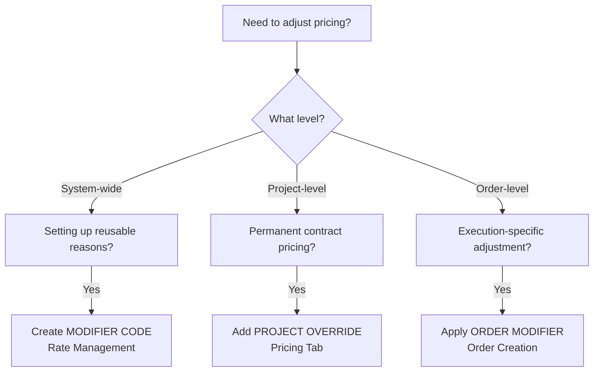

# Pricing Concepts Guide

**Quick reference for understanding the pricing mechanisms in the Photography ERP**

---

## 🎯 Overview

The pricing system uses **three distinct mechanisms** for different purposes:

| Concept | What It Does | When to Use |
| :--- | :--- | :--- |
| **Modifier Codes** | Define reusable adjustment reasons | Setting up operational patterns |
| **Project Overrides** | Set permanent custom rates | Negotiating contract-specific pricing |
| **Order Modifiers** | Apply percentage adjustments at execution time | Handling rush, weekend, complexity scenarios |

> **Terminology Note:**
>
> - **Cost rate** = Expense (what we pay)
> - **Client rate** = Revenue (what we charge)

### Pricing Hierarchy

Each level builds on the one above:

```text
Rate Item (what)           →  "Photographer Hour"
    ↓
Rate Card (how much)       →  €50 expense / €100 revenue
    ↓
Project Override (custom)  →  €55 expense / €110 revenue (for this client)
    ↓
Billing Line (this order)  →  3 hrs × €110 × 1.5x RUSH = €495
```

| Level | Lives In | Role |
|:---|:---|:---|
| **Rate Item** | Rate Management | Reusable service definition (name, unit type). No price. |
| **Rate Card** | Rate Management | Assigns expense + revenue rates to Rate Items |
| **Project Override** | Project Pricing Tab | Replaces Rate Card rates for a specific client/project |
| **Billing Line** | Order Billing Tab | Concrete charge: quantity × rate × modifiers on one order |

---

## 1️⃣ Modifier Codes (Rate Management)

### Purpose

Create a **controlled catalogue** of standardized adjustment reasons that can be reused across projects.

### What They Are

- Pre-defined codes like `RUSH`, `WEEKEND`, `COMPLEXITY_HIGH`
- Display names shown to users (e.g., "Rush / Urgent Delivery")
- Used for consistent reporting and audit trails

### When to Use

- **Before** you start applying modifiers to orders
- When you need a **standardized reason** that will be used repeatedly
- For operational patterns that affect many projects

### Example Use Cases

```text
Code: RUSH
Display: Rush / Urgent Delivery
Usage: Client needs photos within 24 hours

Code: WEEKEND
Display: Weekend / Holiday Work
Usage: Shooting on Saturday/Sunday

Code: LOYALTY_DISCOUNT
Display: Repeat Client Discount
Usage: Long-term client relationship pricing
```

### Where to Manage

**Rate Management > Modifier Codes**

---

## 2️⃣ Project Overrides (Pricing Tab)

### Purpose

Set **permanent custom rates** for specific rate items within a project, replacing the base rates from your rate card.

### What They Are

- Absolute currency amounts (€90 instead of €100)
- Apply to **all orders** within the project
- Free-text reason field (each negotiation is unique)
- Immutable once orders use them

### When to Use

- **Contract negotiations** with specific clients
- Custom pricing tiers for enterprise clients
- Market-specific adjustments for international projects
- Competitive pricing matches

### Example Use Cases

```text
Rate Item: Photographer Hour
Base Rate: €100/hr (revenue) | €70/hr (expense)
Override: €85/hr (revenue) | €70/hr (expense)
Reason: "Annual contract discount - 15% off standard rate per sales approval #2024-089"

---

Rate Item: Retouched Photo
Base Rate: €25 (revenue) | €15 (expense)
Override: €18 (revenue) | €12 (expense)
Reason: "Startup tier pricing for first 6 months as per founder agreement"
```

### Where to Manage

**Project > Pricing Tab > Project Overrides**

---

## 3️⃣ Order Modifiers (Order Execution)

### Purpose

Apply **execution-specific adjustments** when creating orders — percentage multipliers for rush delivery, weekend work, complexity, or any other operational scenario.

> **Key principle:** Workflow blocks define **operational flow** (process steps). They do NOT store pricing modifiers. All modifiers are applied by the operator at **order creation time**, where actual execution context is known.

### What They Are

- Percentage multipliers (1.2x, 1.5x, 0.9x) applied at order creation
- Use **Modifier Codes** from dropdown (standardized reasons)
- Separate adjustments for revenue (client) and expense (cost)
- Specific to individual orders
- Stored on the Billing Line Instance for full audit trail

### When to Use

- **Rush/urgent** orders requiring premium pricing
- **Weekend/holiday** work with different cost structures
- **Complexity** adjustments for unusual shoots
- **Client-specific** one-off adjustments
- **Any scenario** requiring a percentage adjustment to rates

### Example Use Cases

```text
Scenario 1: Rush Weekend Photo Shoot
--------------------------------------
Workflow Step: Photo Shoot (4 hours)
Base Rate: €100/hr (revenue) | €70/hr (expense)
Order Modifier: Revenue 1.5x (RUSH), Expense 1.2x (WEEKEND)
Final: €150/hr (revenue) | €84/hr (expense)

---

Scenario 2: Standard Order (No Adjustments)
---------------------------------------------
Workflow Step: Retouching (20 photos)
Base Rate: €25/photo (revenue) | €15/photo (expense)
Order Modifier: 1.0x (no adjustment)
Final: €25/photo (revenue) | €15/photo (expense)

---

Scenario 3: Complex Location Shoot
------------------------------------
Workflow Step: Photo Shoot (6 hours)
Base Rate: €85/hr (project override rate)
Order Modifier: Revenue 1.2x (COMPLEXITY_HIGH), Expense 1.1x (COMPLEXITY_HIGH)
Final: €102/hr (revenue) | €77/hr (expense)
```

### Where to Apply

**Orders > Create Order > Billing Line Configuration**

---

## 📊 Decision Tree



---

## 🔄 How They Work Together

### Real-World Scenario: Wedding Photography Project

1. **Setup Phase** (Rate Management)

   ```text
   Create Modifier Code: WEEKEND
   Display: "Weekend / Holiday Work"
   ```

2. **Project Negotiation** (Project Overrides)

   ```text
   Client negotiated €85/hr instead of €100/hr
   Add Project Override for "Photographer Hour"
   Reason: "VIP client annual contract discount"
   ```

3. **Order Execution** (Order Creation)

   ```text
   Creating order for Saturday wedding shoot:
   - Workflow step: Photo Shoot (8 hours)
   - Uses project override rate: €85/hr
   - Operator applies modifier: 1.2x (WEEKEND code)
   - Final revenue rate: €85 × 1.2 = €102/hr
   ```

**Result:**

- Base rate: €100/hr
- Project override: €85/hr
- Weekend premium applied at order: €102/hr (€85 × 1.2)

---

## ⚡ Key Differences

### Modifier Codes vs Project Overrides

| Aspect | Modifier Codes | Project Overrides |
| :--- | :--- | :--- |
| **Type** | Reason catalogue | Rate replacement |
| **Format** | Code + Display name | Absolute amounts |
| **Scope** | System-wide | Project-specific |
| **Reason** | N/A (the code IS the reason) | Free text (unique negotiation) |
| **Used by** | Order modifiers | All project orders |

### Project Overrides vs Order Modifiers

| Aspect | Project Overrides | Order Modifiers |
| :--- | :--- | :--- |
| **Nature** | Permanent replacement | Per-order adjustment |
| **When applied** | Always in project | When order is created |
| **Value type** | Absolute (€90) | Percentage (1.5x) |
| **Reason format** | Free text | Modifier Code (from dropdown) |
| **Example** | "Annual contract €85/hr" | "This order = 1.5x rush" |

---

## ✅ Best Practices

### Do

- ✅ Create Modifier Codes **first** before creating orders
- ✅ Use Project Overrides for **strategic** pricing decisions
- ✅ Use Order Modifiers for **operational** adjustments (rush, weekend, complexity)
- ✅ Document reasons clearly (especially for overrides)
- ✅ Keep Modifier Code names descriptive and consistent

### Don't

- ❌ Create duplicate Modifier Codes (use existing ones)
- ❌ Use Project Overrides for temporary adjustments (that's what order modifiers are for)
- ❌ Apply Order Modifiers without a Modifier Code reason
- ❌ Change Project Overrides after orders are confirmed (they become immutable)

---

## 🎓 Quick Answer Guide

**Q: How do I give a client a discount?**
A: Use **Project Override** if it's a permanent contract rate. Use **Order Modifier** with a discount code (e.g., 0.9x LOYALTY_DISCOUNT) for one-off discounts.

**Q: How do I charge more for rush delivery?**
A: Create a **Modifier Code** called `RUSH`, then apply it as an **Order Modifier** (e.g., 1.5x) when creating the order.

**Q: How do I track why rates were adjusted?**
A: **Project Overrides** use free text for unique reasons. **Order Modifiers** use standardized **Modifier Codes** for consistent reporting.

**Q: Can I combine them?**
A: Yes! Final rate calculation:

```text
Final Rate = (Base Rate OR Project Override) × Order Modifier
```

**Q: Where do workflow blocks fit in?**
A: Workflow blocks define the **operational process** (Pro Assigned → Photo Shoot → Retouching → QA → Delivery). Billable blocks optionally reference a Rate Item to link to pricing. Modifiers are applied at **order creation**, not on the block itself.

**Q: Which one affects my analytics?**
A: All three! **Modifier Codes** enable reporting by reason. **Project Overrides** show contract pricing. **Order Modifiers** show execution adjustments.
