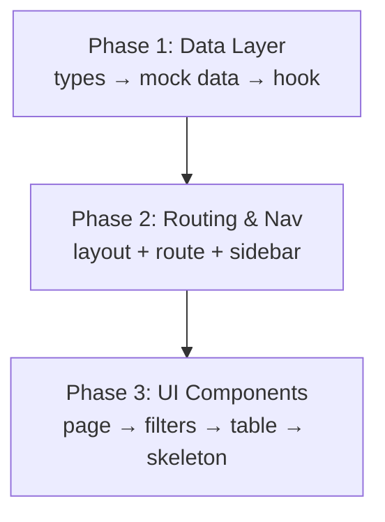

# Team Page — Spec & Phased Implementation Plan

Central Splento team-member directory accessible from the left-side navigation. Read-only data table with search, multi-column sort, multi-select filtering, and server-ready pagination. Follows the pathless layout pattern established by `_rates`.

---

## Data Model

### `SplTeamMember` type (new in `src/types/team.ts`)

```ts
type TeamRole =
  | "ops"
  | "admin"
  | "accountant"
  | "photo_editor"
  | "video_editor"
  | "photographer"
  | "videographer"
  | "analytics";

type TeamMemberStatus = "active" | "paused" | "inactive";

interface RolePermission {
  key: string;       // e.g. "orders.view", "billing.edit"
  label: string;
}

interface TeamRoleDefinition {
  id: TeamRole;
  label: string;
  permissions: RolePermission[];
}

interface SplTeamMember {
  id: string;
  name: string;
  email: string;
  avatarUrl: string | null;
  role: TeamRole;
  status: TeamMemberStatus;
  dateJoined: string;  // ISO 8601
  country: string;
  city: string;
}
```

### Paginated response envelope

```ts
interface TeamMembersPage {
  items: SplTeamMember[];
  total: number;
  page: number;
  pageSize: number;
}
```

---

## File & Component Structure

```text
src/
├── types/
│   └── team.ts                          [NEW]  Types above
├── data/
│   └── mock-team-members.ts             [NEW]  30+ realistic entries
├── hooks/
│   └── useTeamMembers.ts                [NEW]  TanStack Query hook (paginated + filtered)
├── components/
│   ├── layouts/
│   │   └── SidebarNav.tsx               [MODIFY] Add "Team" nav item
│   └── Team/                            [NEW]  All team page components
│       ├── TeamLayout.tsx               [NEW]  Outlet wrapper (mirrors RatesLayout)
│       ├── TeamPage.tsx                 [NEW]  Page shell: header, search, filters, table
│       ├── TeamTable.tsx                [NEW]  Data table with sort headers
│       ├── TeamFilters.tsx              [NEW]  Filter bar (role, status, country, city)
│       └── TeamTableSkeleton.tsx        [NEW]  Skeleton loading rows
└── router.tsx                           [MODIFY] Add _team layout + /team routes
```

> [!NOTE]
> The existing `mock-team.ts` / `useTeam.ts` / `TeamMembers.tsx` serve the **order-level** team tab (assign photographers to a single order). They are a separate concern and will remain untouched.

---

## Proposed Changes

### Phase 1 — Data Layer ✅ CREATED

#### [NEW] [team.ts](file:///Users/eugene/Library/CloudStorage/GoogleDrive-info@semeykin.com/My%20Drive/Antigravity/ERP/src/types/team.ts) ✅

- `TeamRole` union, `TeamMemberStatus` union, `RolePermission`, `TeamRoleDefinition`, `SplTeamMember`, `TeamMembersPage` interfaces
- `TEAM_ROLES` constant array of `TeamRoleDefinition` (with placeholder permissions — UI for permissions is out of scope)
- `ROLE_LABEL_MAP` derived lookup for display labels

#### [NEW] [mock-team-members.ts](file:///Users/eugene/Library/CloudStorage/GoogleDrive-info@semeykin.com/My%20Drive/Antigravity/ERP/src/data/mock-team-members.ts) ✅

- 35 realistic `SplTeamMember` entries
- Spread across all `TeamRole` values
- Diverse countries (UK, Germany, Spain, France, Netherlands, US, India, Australia) and cities
- Mix of `active` / `paused` / `inactive` statuses
- ISO 8601 `dateJoined` strings spanning 2022–2026
- HeroUI avatar API URLs with initials fallback handled at render time

#### [NEW] [useTeamMembers.ts](file:///Users/eugene/Library/CloudStorage/GoogleDrive-info@semeykin.com/My%20Drive/Antigravity/ERP/src/hooks/useTeamMembers.ts) ✅

- **Params**: `page`, `pageSize`, `search`, `sortKey`, `sortDirection`, `filters` (role[], status, country[], city[])
- **Query key** encodes all params for automatic cache invalidation
- **queryFn** simulates server-side: filter → search → sort → paginate over `ALL_TEAM_MEMBERS`
- Returns `{ data: TeamMembersPage, isLoading, error }`
- Uses `DEFAULT_STALE_TIME` and `MOCK_API_DELAY` from `query-config.ts`
- Uses `keepPreviousData` for smooth pagination transitions
- Ready for real API swap (replace `queryFn` body only)
- Also exports `useTeamCountryOptions()` and `useTeamCityOptions()` for filter dropdowns

**Acceptance criteria:**

- [x] Mock data has ≥ 30 entries with all roles represented
- [ ] Types compile (`npx tsc --noEmit`)
- [ ] Hook returns correctly filtered/sorted/paginated data

---

### Phase 2 — Routing & Navigation ✅ CREATED

#### [MODIFY] [router.tsx](file:///Users/eugene/Library/CloudStorage/GoogleDrive-info@semeykin.com/My%20Drive/Antigravity/ERP/src/router.tsx) ✅

- Add pathless `_team` layout route (parent: `rootRoute`, id: `"_team"`)
- Add `/team` index route (parent: `teamLayoutRoute`)
- Register in `routeTree` alongside `ratesLayoutRoute`

#### [NEW] [TeamLayout.tsx](file:///Users/eugene/Library/CloudStorage/GoogleDrive-info@semeykin.com/My%20Drive/Antigravity/ERP/src/components/Team/TeamLayout.tsx) ✅

- Simple `<Outlet />` wrapper (identical pattern to `RatesLayout.tsx`)

#### [MODIFY] [SidebarNav.tsx](file:///Users/eugene/Library/CloudStorage/GoogleDrive-info@semeykin.com/My%20Drive/Antigravity/ERP/src/components/layouts/SidebarNav.tsx) ✅

- Add `{ label: "Team", path: "/team", icon: "lucide:users" }` to `NAV_ITEMS` array (position: after "Orders", before "Rate Management")

**Acceptance criteria:**

- [ ] `/team` route resolves and renders the TeamPage component
- [ ] "Team" appears in sidebar nav and highlights when active
- [ ] Other routes unaffected

---

### Phase 3 — UI Components ⚠️ CREATED (has TS errors to fix)

> [!WARNING]
> Files created but have HeroUI v3 API mismatches that need fixing:
>
> - `Select`: uses `selectedKeys`/`onSelectionChange` — v3 uses `selectedKey` + different multi-select API
> - `Avatar`: uses `name` prop — v3 uses `Avatar`/`AvatarImage`/`AvatarFallback` compound pattern
> - `Chip`: uses `variant="dot"` and `color="secondary"` — not available in v3; need MCP lookup for correct API

#### [NEW] [TeamPage.tsx](file:///Users/eugene/Library/CloudStorage/GoogleDrive-info@semeykin.com/My%20Drive/Antigravity/ERP/src/components/Team/TeamPage.tsx) ⚠️

Page shell mirroring `RateManagementPage` layout:

- `<Surface>` wrapper with `min-h-screen bg-surface rounded-none shadow-none pb-20 p-12`
- `<Breadcrumbs>`: Administration → Team Directory
- `<h1>` heading: "Team Directory"
- `<p>` subtitle with member count
- "Invite Member" `<Button variant="primary" size="lg" isDisabled>` — placeholder, non-functional
- Uses existing `<FilterBar>` for search + status tabs
- `<TeamFilters>` for dropdown filters (role, country, city)
- `<TeamTable>` component  
- Pagination controls (prev/next buttons + page indicator)

Manages state:

- `searchQuery` (via `useDeferredValue` for smooth typing)
- `page`, `pageSize` (default 50)
- `sortKey` (default `"name"`), `sortDirection` (default `"asc"`)
- `filters`: `{ roles: TeamRole[], status: TeamMemberStatus | "all", countries: string[], cities: string[] }`

#### [NEW] [TeamFilters.tsx](file:///Users/eugene/Library/CloudStorage/GoogleDrive-info@semeykin.com/My%20Drive/Antigravity/ERP/src/components/Team/TeamFilters.tsx) ⚠️

Dropdown filters (status handled by `FilterBar` tabs above):

- **Role** — multi-select `<Select>` populated from `TEAM_ROLES`
- **Country** — multi-select `<Select>`, options derived from data
- **City** — multi-select `<Select>`, options derived from data

#### [NEW] [TeamTable.tsx](file:///Users/eugene/Library/CloudStorage/GoogleDrive-info@semeykin.com/My%20Drive/Antigravity/ERP/src/components/Team/TeamTable.tsx) ⚠️

Pure presentation table reusing `pricing/Table` compound component:

- **Avatar** column: `<Avatar>` with src + initials fallback
- **Name**: bold text
- **Email**: `text-default-500`
- **Role**: `<Chip>` with role-specific color mapping
- **Status**: `<Chip>` — green for active, amber for paused, default for inactive
- **Date Joined**: `formatRelativeTime(dateJoined)` with `title={formatAbsoluteTime(dateJoined)}`
- **Country** / **City**: plain text

Sortable column headers via `Table.SortButton`. Empty state via `pricing/EmptyState`.

#### [NEW] [TeamTableSkeleton.tsx](file:///Users/eugene/Library/CloudStorage/GoogleDrive-info@semeykin.com/My%20Drive/Antigravity/ERP/src/components/Team/TeamTableSkeleton.tsx) ✅

- Mirrors table column layout with `<Skeleton>` placeholders
- 10 skeleton rows

**Acceptance criteria:**

- [ ] Fix TS errors (HeroUI v3 API alignment via MCP)
- [ ] Table renders all 8 columns correctly
- [ ] Search filters by name and email
- [ ] All 4 filter controls work independently and in combination
- [ ] Sort toggles direction on column header click
- [ ] Pagination shows correct page / total and navigates
- [ ] Skeleton displays while loading
- [ ] Empty state shows when no results
- [ ] "Invite Member" button is visible but disabled

---

## Verification Plan

### Automated

```bash
# TypeScript compilation
npx tsc --noEmit

# Lint
npm run lint

# Build
npm run build
```

No existing test framework is configured in the project (no `.test.` or `.spec.` files found), so we rely on type-checking, lint, and build as automated gates.

### Manual (browser)

1. **Navigation**: Click "Team" in sidebar → page loads, nav item highlights
2. **Table rendering**: 20 rows visible, all 8 columns populated
3. **Search**: Type a name fragment → table filters; clear → resets
4. **Filters**: Select multiple roles → table shows matching; combine with status tab → intersection works; clear filters → full list
5. **Sort**: Click "Name" header → sorts A→Z; click again → Z→A; click "Date Joined" → chronological sort
6. **Pagination**: Navigate to page 2 → different members shown; page indicator updates; prev/next disable at boundaries
7. **Skeleton**: Hard-refresh → skeleton rows appear briefly before data
8. **Empty state**: Search for nonsense string → "No members found" message
9. **Invite button**: Visible but cannot be pressed (disabled state)
10. **Routing**: Direct-navigate to `/team` in address bar → page loads; back/forward browser buttons work

---

## Dependency Order



Phases must be completed in order. Within each phase, files can be created in parallel.
